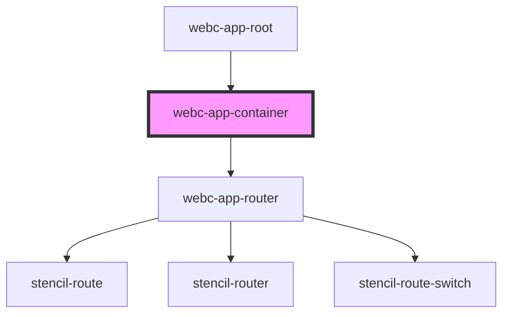

# webc-app-container

<!-- Auto Generated Below -->

## Slots

| Slot       | Description                                                                  |
| ---------- | ---------------------------------------------------------------------------- |
|            | your content or if nothing, your routing point <code>webc-app-router</code>; |
| `"after"`  | place for final content;                                                     |
| `"before"` | content that goes behind this component in the DOM;                          |

## CSS Custom Properties

| Name                       | Description              |
| -------------------------- | ------------------------ |
| `--webc-app-container-gap` | Background of the button |

## Dependencies

### Used by

 - [webc-app-root](../webc-app-root)

### Depends on

- [webc-app-router](../webc-app-router)

### Graph

----------------------------------------------

*Made by [WebCardinal](https://github.com/webcardinal) contributors.*
