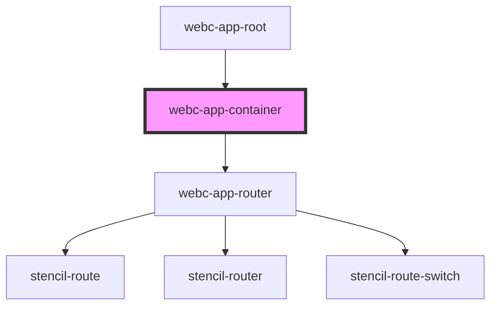

# webc-app-container

<!-- Auto Generated Below -->

## Slots

| Slot       | Description                                                                                                                                        |
| ---------- | -------------------------------------------------------------------------------------------------------------------------------------------------- |
|            | Your content or if nothing, your routing point <code>webc-app-router</code>.    Using this slot you can wrap all pages with a custom component; |
| `"after"`  | Place for final content.          A "footer" can be easily implemented using this slot;                                                         |
| `"before"` | Content that goes behind this component in the DOM.           A "header" can be easily implemented using this slot;                             |

## CSS Custom Properties

| Name           | Description                    |
| -------------- | ------------------------------ |
| `--background` | Background for all your pages. |
| `--gap`        | Gap between slots.             |

## Dependencies

### Used by

 - [webc-app-root](../webc-app-root)

### Depends on

- [webc-app-router](../webc-app-router)

### Graph

----------------------------------------------

*Made by [WebCardinal](https://github.com/webcardinal) contributors.*
