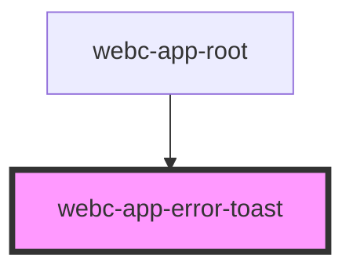

# webc-app-error-toast

<!-- Auto Generated Below -->

## CSS Custom Properties

| Name                                              | Description                  |
| ------------------------------------------------- | ---------------------------- |
| `--webc-app-error-toast-error-background-color`   | Background for error toast   |
| `--webc-app-error-toast-error-color`              | Color for error toast        |
| `--webc-app-error-toast-warning-background-color` | Background for warning toast |
| `--webc-app-error-toast-warning-color`            | Color for warning toast      |

## Dependencies

### Used by

 - [webc-app-root](../webc-app-root)

### Graph

----------------------------------------------

*Made by [WebCardinal](https://github.com/webcardinal) contributors.*
