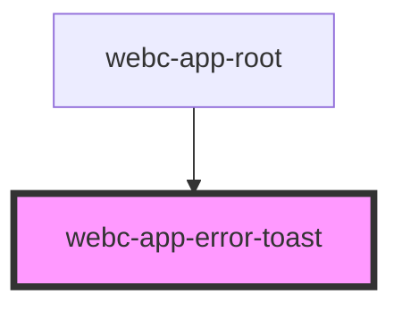

# webc-app-error-toast

<!-- Auto Generated Below -->

## CSS Custom Properties

| Name                   | Description |
| ---------------------- | ----------- |
| `--error-background`   |             |
| `--error-color`        |             |
| `--margin`             |             |
| `--max-height`         |             |
| `--padding`            |             |
| `--radius`             |             |
| `--warning-background` |             |
| `--warning-color`      |             |
| `--width`              |             |
| `--z-index`            |             |

## Dependencies

### Used by

 - [webc-app-root](../webc-app-root)

### Graph

----------------------------------------------

*Made by [WebCardinal](https://github.com/webcardinal) contributors.*
