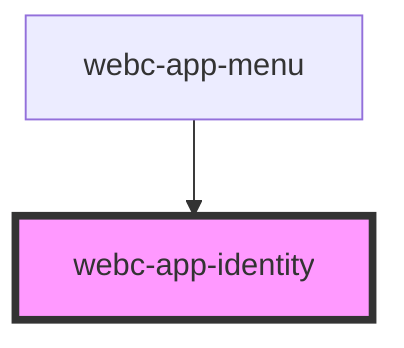

# webc-app-identity

<!-- Auto Generated Below -->

## Properties

| Property | Attribute | Description                          | Type     | Default     |
| -------- | --------- | ------------------------------------ | -------- | ----------- |
| `avatar` | `avatar`  | Path or URL to an image.             | `string` | `undefined` |
| `email`  | `email`   | Email of your brand or organization. | `string` | `undefined` |
| `name`   | `name`    | Name of your brand or organization.  | `string` | `undefined` |

## Events

| Event                            | Description                                                                                                                                      | Type               |
| -------------------------------- | ------------------------------------------------------------------------------------------------------------------------------------------------ | ------------------ |
| `webcardinal:config:getIdentity` | All properties enumerated before are automatically filled by webc-app-identity when this event is fired from <code>ApplicationController</code>. | `CustomEvent<any>` |

## CSS Custom Properties

| Name                | Description                                |
| ------------------- | ------------------------------------------ |
| `--avatar-radius`   | Picture radius.                            |
| `--avatar-width`    | Size of the picture.                       |
| `--color`           | Color of all text elements.                |
| `--column-gap`      | Horizontal space.                          |
| `--email-font-size` | Size of font for "email".                  |
| `--name-font-size`  | Size of font for "name".                   |
| `--row-gap`         | Vertical space between "name" and "email". |

## Dependencies

### Used by

 - [webc-app-menu](../webc-app-menu/webc-app-menu)

### Graph

----------------------------------------------

*Made by [WebCardinal](https://github.com/webcardinal) contributors.*
