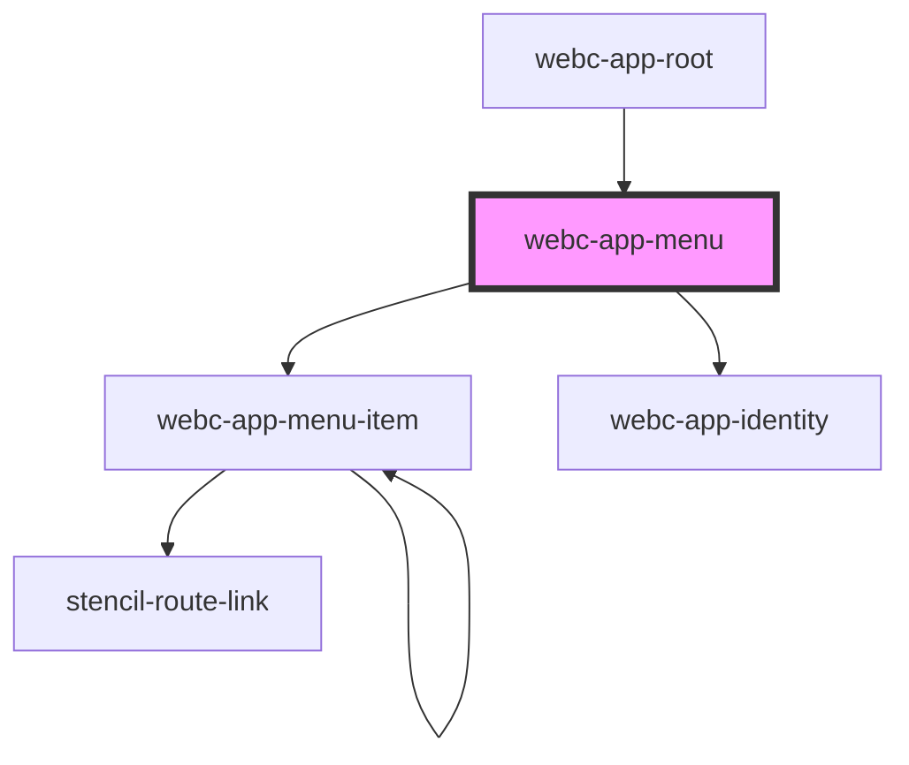

# webc-app-menu

<!-- Auto Generated Below -->

## Properties

| Property          | Attribute          | Description                                                                                                                                                                                                                                                                                                          | Type      | Default            |
| ----------------- | ------------------ | -------------------------------------------------------------------------------------------------------------------------------------------------------------------------------------------------------------------------------------------------------------------------------------------------------------------- | --------- | ------------------ |
| `basePath`        | `base-path`        | There is the possibility to change the base path of your application, using <code>base</code> HTML Element: <psk-example>    <psk-code>     <base href="/my-custom-base">    </psk-code> </psk-example>  Both <code>webc-app-menu</code> and <code>webc-app-router</code> must share the same <code>basePath</code>. | `string`  | `''`               |
| `disableIdentity` | `disable-identity` | Decides if <code>webc-app-identity</code> is rendered.  This property is set by Custom Variable <code>--webc-app-menu-disable-identity</code>.                                                                                                                                                                    | `boolean` | `false`            |
| `items`           | --                 | This Array is received from <code>ApplicationController</code>.                                                                                                                                                                                                                                                      | `any[]`   | `[]`               |
| `mode`            | `mode`             |                                                                                                                                                                                                                                                                                                                      | `string`  | `this.defaultMode` |

## Events

| Event                           | Description                                                                                                                                                | Type               |
| ------------------------------- | ---------------------------------------------------------------------------------------------------------------------------------------------------------- | ------------------ |
| `webcardinal:config:getRouting` | Routing configuration received from <code>ApplicationController</code>.  This configuration includes different settings for pages, skins, modals, etc.; | `CustomEvent<any>` |

## CSS Custom Properties

| Name                               | Description                                                                                                                                  |
| ---------------------------------- | -------------------------------------------------------------------------------------------------------------------------------------------- |
| `--webc-app-menu-color`            | Color of menu.                                                                                                                               |
| `--webc-app-menu-disable-identity` | Default value is <code>false</code>.                                                                                                         |
| `--webc-app-menu-gap`              | Space between slots.                                                                                                                         |
| `--webc-app-menu-items-gap`        | Space between <code>webc-app-menu-item</code>s.                                                                                              |
| `--webc-app-menu-mode`             | Default value is <code>vertical</code>.  Other values: <small><code>none</code>, <code>horizontal</code> and <code>mobile</code>.</small> |
| `--webc-app-menu-z-index`          |                                                                                                                                              |

## Dependencies

### Used by

 - [webc-app-root](../../webc-app-root)

### Depends on

- [webc-app-menu-item](../webc-app-menu-item)
- [webc-app-identity](../../webc-app-identity)

### Graph

----------------------------------------------

*Made by [WebCardinal](https://github.com/webcardinal) contributors.*
