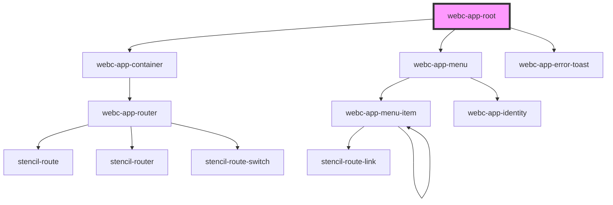

# webc-app-root

<!-- Auto Generated Below -->

## Properties

| Property              | Attribute               | Description                                                                                                       | Type      | Default          |
| --------------------- | ----------------------- | ----------------------------------------------------------------------------------------------------------------- | --------- | ---------------- |
| `disableHeader`       | `disable-header`        | It decides if the header is disabled or not.                                                                      | `boolean` | `false`          |
| `disableLoaderHiding` | `disable-loader-hiding` | It decides if the spinner of application should be automatically hidden                                           | `boolean` | `false`          |
| `loader`              | `loader`                | Component tag name for a UI loader.                                                                               | `string`  | `'webc-spinner'` |
| `preload`             | `preload`               | Path to a JavaScript file which is loaded before configuration from <code>webcardinal.json</code> is applied.  | `string`  | `undefined`      |

## Events

| Event                            | Description                                                                                              | Type               |
| -------------------------------- | -------------------------------------------------------------------------------------------------------- | ------------------ |
| `webcardinal:config:getLogLevel` | LogLevel configuration is received from <code>ApplicationController</code> when this event is fired.  | `CustomEvent<any>` |

## Dependencies

### Depends on

- [webc-app-container](../webc-app-container)
- [webc-app-menu](../webc-app-menu/webc-app-menu)
- [webc-app-error-toast](../webc-app-error-toast)

### Graph

----------------------------------------------

*Made by [WebCardinal](https://github.com/webcardinal) contributors.*
