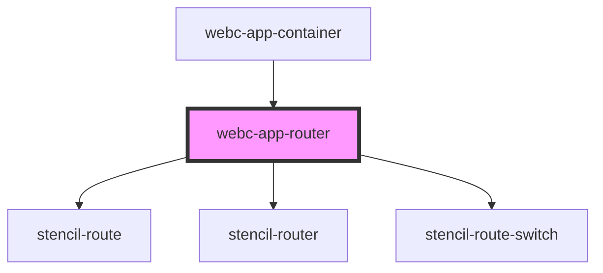

# webc-app-router

<!-- Auto Generated Below -->

## Properties

| Property       | Attribute       | Description                                                                                                                                                                                                                                                                                                                    | Type     | Default     |
| -------------- | --------------- | ------------------------------------------------------------------------------------------------------------------------------------------------------------------------------------------------------------------------------------------------------------------------------------------------------------------------------ | -------- | ----------- |
| `basePath`     | `base-path`     | There is the possibility to change the base path of your application, using <code>base</code> HTML Element: <psk-example>    <psk-code>     <base href="/my-custom-base/sub-path/">    </psk-code> </psk-example>  Both <code>webc-app-router</code> and <code>webc-app-menu</code> must share the same <code>basePath</code>. | `string` | `''`        |
| `fallbackPage` | `fallback-page` | Similar to 404 page, if <code>window.location.href</code> does not match any page, this fallback will be shown. This page can be changed from <code>webcardinal.json</code>, using <code>pagesFallback</code>.                                                                                                                 | `any`    | `undefined` |
| `routes`       | --              | This Array is received from <code>ApplicationController</code>.                                                                                                                                                                                                                                                                | `any[]`  | `[]`        |

## Events

| Event                           | Description                                                                                                                                                | Type               |
| ------------------------------- | ---------------------------------------------------------------------------------------------------------------------------------------------------------- | ------------------ |
| `webcardinal:config:getRouting` | Routing configuration received from <code>ApplicationController</code>.  This configuration includes different settings for pages, skins, modals, etc.; | `CustomEvent<any>` |

## Dependencies

### Used by

 - [webc-app-container](../webc-app-container)

### Depends on

- stencil-route
- stencil-router
- stencil-route-switch

### Graph

----------------------------------------------

*Made by [WebCardinal](https://github.com/webcardinal) contributors.*
