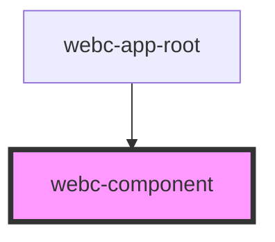

# webc-component

<!-- Auto Generated Below -->

## Properties

| Property     | Attribute    | Description                                                                                                                                                                                          | Type          | Default     |
| ------------ | ------------ | ---------------------------------------------------------------------------------------------------------------------------------------------------------------------------------------------------- | ------------- | ----------- |
| `controller` | `controller` | This property is a string that will permit the developer to choose his own controller. If no value is set then the null default value will be taken and the component will use the basic Controller. | `string`      | `''`        |
| `element`    | --           | The reference to actual CustomElement / Component that is created.                                                                                                                                   | `HTMLElement` | `undefined` |
| `template`   | `template`   | The name of the template that will be loaded. The generated path will have the format <code>${basePath + skinPath}/elements/${template}.html</code>.                                                 | `string`      | `undefined` |

## Events

| Event                              | Description                                           | Type               |
| ---------------------------------- | ----------------------------------------------------- | ------------------ |
| `webcardinal:model:get`            | Through this event the model is received.             | `CustomEvent<any>` |
| `webcardinal:parentChain:get`      |                                                       | `CustomEvent<any>` |
| `webcardinal:translationModel:get` | Through this event the translation model is received. | `CustomEvent<any>` |

## Methods

### `getListeners() => Promise<ComponentListenersService>`

The listeners are exposed by this method.

#### Returns

Type: `Promise<ComponentsListenerService>`

### `getModel() => Promise<any>`

The model is exposed by this method.

#### Returns

Type: `Promise<any>`

### `getTranslationModel() => Promise<any>`

The translation model is exposed by this method.

#### Returns

Type: `Promise<any>`

## Dependencies

### Used by

 - [webc-app-root](../webc-app/webc-app-root)

### Graph

----------------------------------------------

*Made by [WebCardinal](https://github.com/webcardinal) contributors.*
