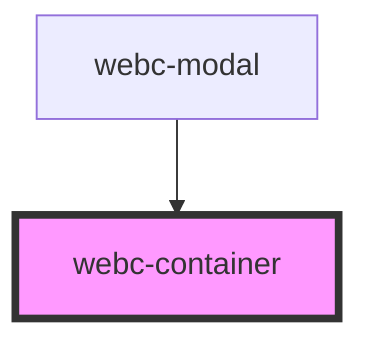

# webc-container

<!-- Auto Generated Below -->

## Properties

| Property             | Attribute             | Description                                                                                                                                                                                          | Type      | Default     |
| -------------------- | --------------------- | ---------------------------------------------------------------------------------------------------------------------------------------------------------------------------------------------------- | --------- | ----------- |
| `controller`         | `controller`          | This property is a string that will permit the developer to choose his own controller. If no value is set then the null default value will be taken and the component will use the basic Controller. | `string`  | `undefined` |
| `disableContainer`   | `disable-container`   | If it is not specified, all the innerHTML will be placed inside the unnamed slot. Otherwise the content will replace the <code>webc-container</code> element form DOM.                               | `boolean` | `false`     |
| `enableTranslations` | `enable-translations` |                                                                                                                                                                                                      | `boolean` | `false`     |

## Events

| Event                                | Description                                                       | Type               |
| ------------------------------------ | ----------------------------------------------------------------- | ------------------ |
| `webcardinal:config:getTranslations` | Enable translations event received from configuration.            | `CustomEvent<any>` |
| `webcardinal:routing:get`            | Routing configuration received from <code>webc-app-router</code>. | `CustomEvent<any>` |

## Methods

### `getModel() => Promise<any>`

The model from controller is exposed by this method.

#### Returns

Type: `Promise<any>`

### `getTranslationModel() => Promise<any>`

The translation model from controller is exposed by this method.

#### Returns

Type: `Promise<any>`

## Dependencies

### Used by

 - [webc-modal](../webc-modal)

### Graph

----------------------------------------------

*Made by [WebCardinal](https://github.com/webcardinal) contributors.*
