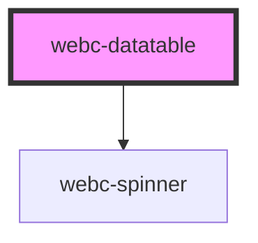

# webc-datatable

<!-- Auto Generated Below -->

## Properties

| Property            | Attribute             | Description | Type      | Default     |
| ------------------- | --------------------- | ----------- | --------- | ----------- |
| `chain`             | `datasource`          |             | `string`  | `undefined` |
| `curentPageIndex`   | `curent-page-index`   |             | `number`  | `0`         |
| `dataSize`          | `data-size`           |             | `number`  | `undefined` |
| `hidePagination`    | `hide-pagination`     |             | `boolean` | `false`     |
| `lastPageIndex`     | `last-page-index`     |             | `number`  | `0`         |
| `loading`           | `loading`             |             | `boolean` | `false`     |
| `pageSize`          | `page-size`           |             | `number`  | `0`         |
| `pageSizeDelta`     | `page-size-delta`     |             | `number`  | `2`         |
| `useInfiniteScroll` | `use-infinite-scroll` |             | `boolean` | `false`     |
| `useOptimisticMode` | `use-optimistic-mode` |             | `boolean` | `false`     |

## Events

| Event                              | Description                                           | Type               |
| ---------------------------------- | ----------------------------------------------------- | ------------------ |
| `webcardinal:model:get`            | Through this event the model is received.             | `CustomEvent<any>` |
| `webcardinal:translationModel:get` | Through this event the translation model is received. | `CustomEvent<any>` |

## Methods

### `clearCurrentPage() => Promise<void>`

#### Returns

Type: `Promise<void>`

### `fillCurrentPage(data: any) => Promise<void>`

#### Returns

Type: `Promise<void>`

## Slots

| Slot         | Description |
| ------------ | ----------- |
| `"-"`        |             |
| `"after -"`  |             |
| `"before -"` |             |
| `"footer -"` |             |
| `"header -"` |             |

## Shadow Parts

| Part                            | Description |
| ------------------------------- | ----------- |
| `"pagination"`                  |             |
| `"pagination-button"`           |             |
| `"pagination-button--active"`   |             |
| `"pagination-button--next"`     |             |
| `"pagination-button--previous"` |             |

## CSS Custom Properties

| Name                             | Description |
| -------------------------------- | ----------- |
| `--pagination-button-background` |             |
| `--pagination-button-border`     |             |
| `--pagination-gap`               |             |

## Dependencies

### Depends on

- [webc-spinner](../webc-spinner)

### Graph

----------------------------------------------

*Made by [WebCardinal](https://github.com/webcardinal) contributors.*
