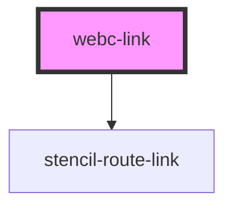

# webc-link

<!-- Auto Generated Below -->

## Properties

| Property | Attribute | Description                                                                                  | Type     | Default     |
| -------- | --------- | -------------------------------------------------------------------------------------------- | -------- | ----------- |
| `href`   | `href`    |                                                                                              | `string` | `undefined` |
| `tag`    | `tag`     | A unique identifier for each page, which was previously set in <code>webcardinal.json</code> | `string` | `undefined` |

## Events

| Event                  | Description                                                                                     | Type               |
| ---------------------- | ----------------------------------------------------------------------------------------------- | ------------------ |
| `webcardinal:tags:get` | Through this event a mapping (tag-page) with all tags is taken from <code>webc-app-root</code>. | `CustomEvent<any>` |

## Dependencies

### Depends on

- stencil-route-link

### Graph

----------------------------------------------

*Made by [WebCardinal](https://github.com/webcardinal) contributors.*
