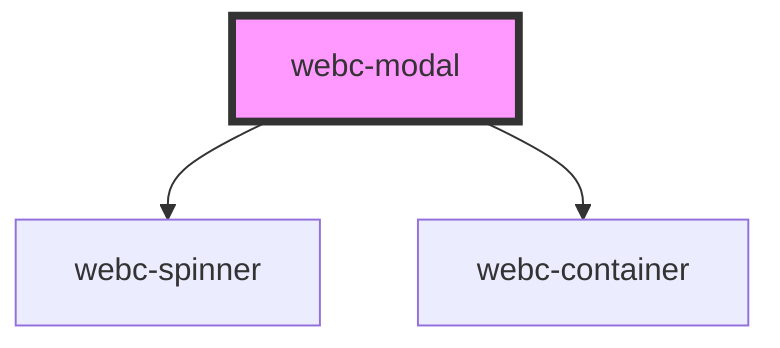

# webc-modal

<!-- Auto Generated Below -->

## Properties

| Property                 | Attribute                  | Description                                                                                                                                                                                          | Type      | Default     |
| ------------------------ | -------------------------- | ---------------------------------------------------------------------------------------------------------------------------------------------------------------------------------------------------- | --------- | ----------- |
| `autoShow`               | `auto-show`                | Sets if the modal will automatically show when the element is constructed.                                                                                                                           | `boolean` | `true`      |
| `cancelButtonText`       | `cancel-button-text`       | The text that will appear on the footer close button, if neither the "footer" slot nor modalFooterContent are provided.                                                                              | `string`  | `'Close'`   |
| `centered`               | `centered`                 | Sets if the popup is centered on the screen or if it appear at the top of the screen.                                                                                                                | `boolean` | `true`      |
| `confirmButtonText`      | `confirm-button-text`      | The text that will appear on the footer confirm button, if neither the "footer" slot nor modalFooterContent are provided.                                                                            | `string`  | `'Ok'`      |
| `controller`             | `controller`               | This property is a string that will permit the developer to choose his own controller. If no value is set then the null default value will be taken and the component will use the basic Controller. | `string`  | `undefined` |
| `disableBackdropClosing` | `disable-backdrop-closing` | Sets if the modal will automatically close when the user clicks outside of it.                                                                                                                       | `boolean` | `true`      |
| `disableCancelButton`    | `disable-cancel-button`    | Sets if the close button will be shown or not.                                                                                                                                                       | `boolean` | `false`     |
| `disableClosing`         | `disable-closing`          | Sets if the modal can be closed                                                                                                                                                                      | `boolean` | `false`     |
| `disableExpanding`       | `disable-expanding`        | Decides if expand button should be displayed                                                                                                                                                         | `boolean` | `false`     |
| `disableFooter`          | `disable-footer`           | Sets if the modal has the footer displayed.                                                                                                                                                          | `boolean` | `false`     |
| `expanded`               | `expanded`                 | Sets if the modal expands to full screen.                                                                                                                                                            | `boolean` | `false`     |
| `modalContent`           | `modal-content`            | The content that will be shown in the modal body, if template is not provided.                                                                                                                       | `string`  | `undefined` |
| `modalDescription`       | `modal-description`        | The content that can be shown in the header, if provided and the "header" slot is missing from the content.                                                                                          | `string`  | `undefined` |
| `modalFooter`            | `modal-footer`             | The content that can be shown in the footer, if provided and the "footer" slot is missing from the content.                                                                                          | `string`  | `undefined` |
| `modalTitle`             | `modal-title`              | The text that will be shown in the modal's header, if the "header" slot is not provided.                                                                                                             | `string`  | `undefined` |
| `model`                  | `model`                    |                                                                                                                                                                                                      | `any`     | `undefined` |
| `template`               | `template`                 | The name of the model that will be loaded. The generated path will have the format <code>${basePath + skinPath}/modals/${template}.html</code>.                                                      | `string`  | `undefined` |
| `translationModel`       | `translation-model`        |                                                                                                                                                                                                      | `any`     | `undefined` |
| `translations`           | `translations`             | If this flag is set it will override the <strong>translations</strong> from <code>webcardinal.json</code>.                                                                                           | `boolean` | `false`     |

## Events

| Event         | Description                                                                                                                                                                                                                               | Type                       |
| ------------- | ----------------------------------------------------------------------------------------------------------------------------------------------------------------------------------------------------------------------------------------- | -------------------------- |
| `closed`      | Event that fires when the modal is pressed (only when the default footer is shown). The event will be passed with a boolean value to specify if the popup was closed due to a button press (true) or a click outside of the popup (false) | `CustomEvent<boolean>`     |
| `confirmed`   | Event that fires when the confirm button is pressed (only when the default footer is shown).                                                                                                                                              | `CustomEvent<any>`         |
| `initialised` | Event that fires when the modal is initialised (after the modal content was successfully loaded).                                                                                                                                         | `CustomEvent<HTMLElement>` |

## Methods

### `destroy() => Promise<void>`

Method that completely removes the modal from the DOM.

#### Returns

Type: `Promise<void>`

### `hide() => Promise<void>`

Method that hides the modal.

#### Returns

Type: `Promise<void>`

### `show() => Promise<void>`

Method that shows the modal.

#### Returns

Type: `Promise<void>`

## Slots

| Slot       | Description                                                                                                                |
| ---------- | -------------------------------------------------------------------------------------------------------------------------- |
|            | The modal body. The content from <code>modalContent</code> property arrives here too.                                      |
| `"footer"` | If a custom footer is desired. Otherwise "cancelButton" and "confirmButtonText" will be rendered.                          |
| `"header"` | If you want a custom header. Otherwise <code>modalTitle</code> and <code>modalDescription</code> will be placed in header. |

## Shadow Parts

| Part        | Description |
| ----------- | ----------- |
| `"cancel"`  |             |
| `"close"`   |             |
| `"confirm"` |             |
| `"content"` |             |
| `"dialog"`  |             |
| `"expand"`  |             |
| `"footer"`  |             |
| `"header"`  |             |
| `"main"`    |             |

## CSS Custom Properties

| Name                          | Description |
| ----------------------------- | ----------- |
| `--backdrop-background`       |             |
| `--background`                |             |
| `--cancel-button-background`  |             |
| `--cancel-button-color`       |             |
| `--color`                     |             |
| `--confirm-button-background` |             |
| `--confirm-button-color`      |             |
| `--description-color`         |             |
| `--footer-align`              |             |
| `--footer-border`             |             |
| `--footer-button-radius`      |             |
| `--header-border`             |             |
| `--header-button-background`  |             |
| `--header-button-color`       |             |
| `--header-button-radius`      |             |
| `--margin`                    |             |
| `--padding`                   |             |
| `--radius`                    |             |
| `--shadow`                    |             |
| `--title-color`               |             |
| `--z-index`                   |             |

## Dependencies

### Depends on

- [webc-spinner](../webc-spinner)
- [webc-container](../webc-container)

### Graph

----------------------------------------------

*Made by [WebCardinal](https://github.com/webcardinal) contributors.*
