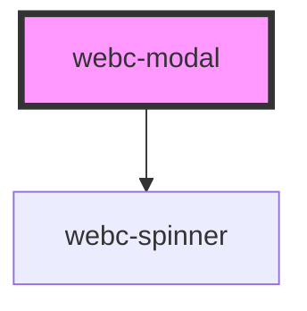

# webc-modal

<!-- Auto Generated Below -->

## Properties

| Property             | Attribute              | Description                                                                                                               | Type      | Default     |
| -------------------- | ---------------------- | ------------------------------------------------------------------------------------------------------------------------- | --------- | ----------- |
| `autoClose`          | `auto-close`           | Sets if the modal will automatically close when the user clicks outside of it                                             | `boolean` | `true`      |
| `autoShow`           | `auto-show`            | Sets if the modal will automatically show when the element is constructed                                                 | `boolean` | `true`      |
| `canClose`           | `can-close`            | Sets if the modal can be closed                                                                                           | `boolean` | `true`      |
| `cancelButtonText`   | `cancel-button-text`   | The text that will appear on the footer close button (if neither the "footer" slot nor modalFooterContent are provided)   | `string`  | `'Close'`   |
| `centered`           | `centered`             | Sets if the popup is centered on the screen or if it appear at the top of the screen                                      | `boolean` | `true`      |
| `confirmButtonText`  | `confirm-button-text`  | The text that will appear on the footer confirm button (if neither the "footer" slot nor modalFooterContent are provided) | `string`  | `'Ok'`      |
| `modalFooterContent` | `modal-footer-content` | The content that can be shown in the footer, if provided and the "footer" slot is missing from the content.               | `string`  | `undefined` |
| `modalName`          | `modal-name`           | The name of the model that will be loaded. The generated path will have the format ${basePath}/modals/${modalName}.html   | `string`  | `undefined` |
| `modalTitle`         | `modal-title`          | The text that will be shown in the modal's header, if neither the "title" slot nor modalTitleContent are provided         | `string`  | `undefined` |
| `modalTitleContent`  | `modal-title-content`  | The content that can be shown in the header, if provided and the "title" slot is missing from the content.                | `string`  | `undefined` |
| `showCancelButton`   | `show-cancel-button`   | Sets if the close button will be shown or not                                                                             | `boolean` | `true`      |
| `showFooter`         | `show-footer`          | Sets if the modal has the footer displayed                                                                                | `boolean` | `true`      |
| `text`               | `text`                 | The content that will be shown in the modal body, if modalName is not provided                                            | `string`  | `undefined` |

## Events

| Event         | Description                                                                                                                                                                                                                               | Type                       |
| ------------- | ----------------------------------------------------------------------------------------------------------------------------------------------------------------------------------------------------------------------------------------- | -------------------------- |
| `closed`      | Event that fires when the modal is pressed (only when the default footer is shown). The event will be passed with a boolean value to specify if the popup was closed due to a button press (true) or a click outside of the popup (false) | `CustomEvent<boolean>`     |
| `confirmed`   | Event that fires when the confirm button is pressed (only when the default footer is shown)                                                                                                                                               | `CustomEvent<any>`         |
| `initialised` | Event that fires when the modal is initialised (after the modal content was successfully loaded)                                                                                                                                          | `CustomEvent<HTMLElement>` |

## Methods

### `destroy() => Promise<void>`

Method that completely removes the modal from the DOM.

#### Returns

Type: `Promise<void>`

### `hide() => Promise<void>`

Method that hides the modal.

#### Returns

Type: `Promise<void>`

### `show() => Promise<void>`

Method that shows the modal.

#### Returns

Type: `Promise<void>`

## Dependencies

### Depends on

- [webc-spinner](../webc-spinner)

### Graph

----------------------------------------------

*Made by [WebCardinal](https://github.com/webcardinal) contributors.*
