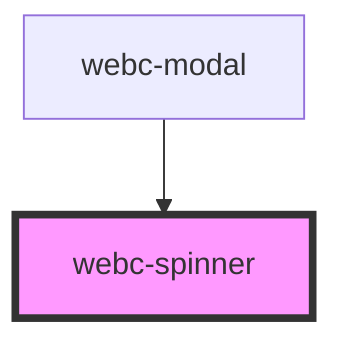

# webc-spinner

<!-- Auto Generated Below -->

## CSS Custom Properties

| Name                | Description |
| ------------------- | ----------- |
| `--animation`       |             |
| `--animation-delay` |             |
| `--background`      |             |
| `--border`          |             |
| `--box-shadow`      |             |
| `--color`           |             |
| `--dot-radius`      |             |
| `--dot-size`        |             |
| `--height`          |             |
| `--radius`          |             |
| `--width`           |             |
| `--z-index`         |             |

## Dependencies

### Used by

 - [webc-modal](../webc-modal)

### Graph

----------------------------------------------

*Made by [WebCardinal](https://github.com/webcardinal) contributors.*
