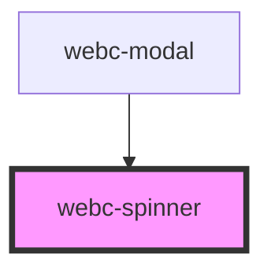

# webc-spinner

<!-- Auto Generated Below -->

## CSS Custom Properties

| Name                             | Description |
| -------------------------------- | ----------- |
| `--webc-spinner-animation`       |             |
| `--webc-spinner-animation-delay` |             |
| `--webc-spinner-background;`     |             |
| `--webc-spinner-border`          |             |
| `--webc-spinner-box-shadow`      |             |
| `--webc-spinner-color`           |             |
| `--webc-spinner-dot-radius`      |             |
| `--webc-spinner-dot-size`        |             |
| `--webc-spinner-height`          |             |
| `--webc-spinner-radius`          |             |
| `--webc-spinner-width`           |             |
| `--webc-spinner-z-index`         |             |

## Dependencies

### Used by

 - [webc-modal](../webc-modal)

### Graph

----------------------------------------------

*Made by [WebCardinal](https://github.com/webcardinal) contributors.*
