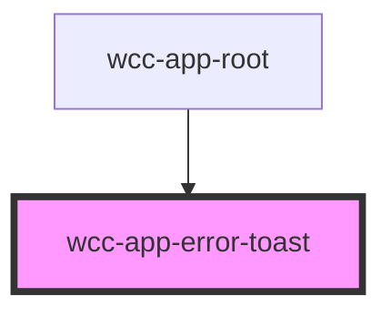

# wcc-app-root

<!-- Auto Generated Below -->

## Dependencies

### Used by

 - [wcc-app-root](../wcc-app/wcc-app-root)

### Graph

----------------------------------------------

*Built with [StencilJS](https://stenciljs.com/)*
