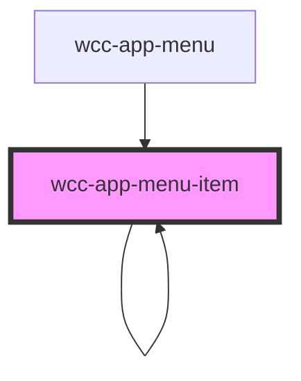

# wcc-app-menu-item

<!-- Auto Generated Below -->

## Properties

| Property | Attribute | Description | Type     | Default     |
| -------- | --------- | ----------- | -------- | ----------- |
| `base`   | `base`    |             | `string` | `''`        |
| `item`   | `item`    |             | `any`    | `undefined` |
| `level`  | `level`   |             | `number` | `0`         |

## Dependencies

### Used by

 - [wcc-app-menu](.)
 - [wcc-app-menu-item](.)

### Depends on

- [wcc-app-menu-item](.)
- stencil-route-link

### Graph

----------------------------------------------

*Built with [StencilJS](https://stenciljs.com/)*
