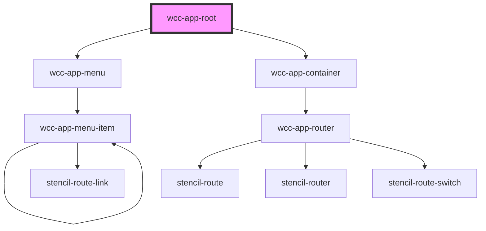

# wcc-app-root

<!-- Auto Generated Below -->

## Properties

| Property         | Attribute    | Description | Type            | Default         |
| ---------------- | ------------ | ----------- | --------------- | --------------- |
| `controllerName` | `controller` |             | `string`        | `undefined`     |
| `history`        | --           |             | `RouterHistory` | `undefined`     |
| `loaderName`     | `loader`     |             | `string`        | `'wcc-spinner'` |

## Dependencies

### Depends on

- [wcc-app-menu](../wcc-app-menu)
- [wcc-app-container](../wcc-app-container)

### Graph

----------------------------------------------

*Built with [StencilJS](https://stenciljs.com/)*
