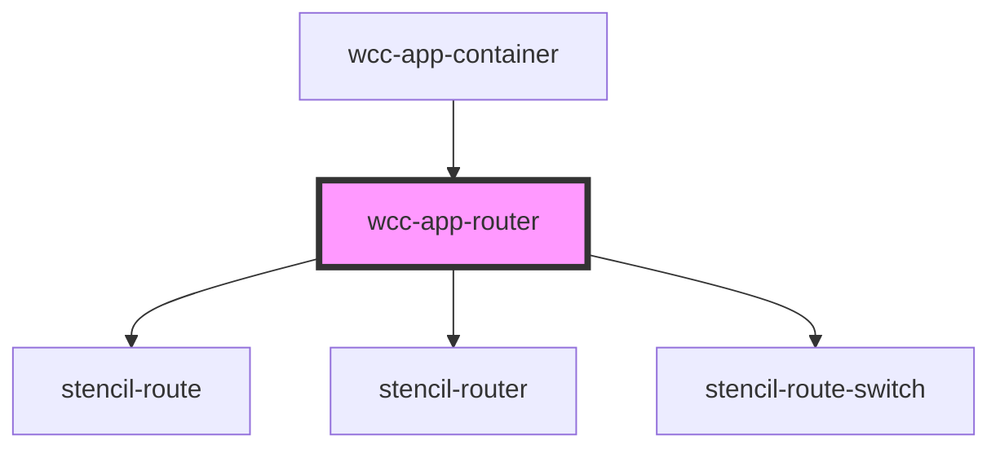

# wcc-app-router

<!-- Auto Generated Below -->

## Properties

| Property   | Attribute | Description | Type     | Default     |
| ---------- | --------- | ----------- | -------- | ----------- |
| `base`     | `base`    |             | `string` | `''`        |
| `fallback` | --        |             | `null`   | `undefined` |
| `root`     | `root`    |             | `string` | `''`        |
| `routes`   | --        |             | `any[]`  | `[]`        |

## Events

| Event                           | Description | Type               |
| ------------------------------- | ----------- | ------------------ |
| `webcardinal:config:getRouting` |             | `CustomEvent<any>` |

## Dependencies

### Used by

 - [wcc-app-container](../wcc-app-container)

### Depends on

- stencil-route
- stencil-router
- stencil-route-switch

### Graph

----------------------------------------------

*Built with [StencilJS](https://stenciljs.com/)*
