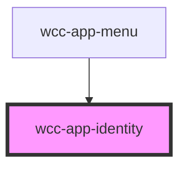

# wcc-app-identity

<!-- Auto Generated Below -->

## Properties

| Property | Attribute | Description | Type     | Default     |
| -------- | --------- | ----------- | -------- | ----------- |
| `avatar` | `avatar`  |             | `string` | `undefined` |
| `email`  | `email`   |             | `string` | `undefined` |
| `name`   | `name`    |             | `string` | `undefined` |

## Events

| Event                            | Description | Type               |
| -------------------------------- | ----------- | ------------------ |
| `webcardinal:config:getIdentity` |             | `CustomEvent<any>` |

## Dependencies

### Used by

 - [wcc-app-menu](../wcc-app-menu/wcc-app-menu)

### Graph

----------------------------------------------

*Built with [StencilJS](https://stenciljs.com/)*
