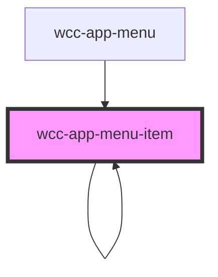

# wcc-app-menu-item

<!-- Auto Generated Below -->

## Properties

| Property   | Attribute   | Description | Type                               | Default                                  |
| ---------- | ----------- | ----------- | ---------------------------------- | ---------------------------------------- |
| `basePath` | `base-path` |             | `string`                           | `''`                                     |
| `item`     | --          |             | `{ path: string; children: any; }` | `{     path: '',     children: null   }` |
| `level`    | `level`     |             | `number`                           | `0`                                      |
| `name`     | `name`      |             | `string`                           | `''`                                     |
| `url`      | `url`       |             | `string`                           | `null`                                   |

## Dependencies

### Used by

 - [wcc-app-menu](../wcc-app-menu)
 - [wcc-app-menu-item](.)

### Depends on

- [wcc-app-menu-item](.)
- stencil-route-link

### Graph

----------------------------------------------

*Built with [StencilJS](https://stenciljs.com/)*
