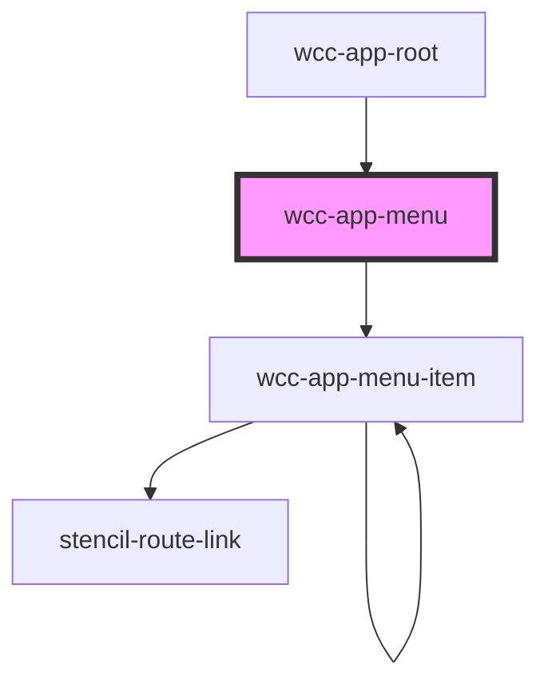

# wcc-app-menu

<!-- Auto Generated Below -->

## Properties

| Property   | Attribute   | Description | Type     | Default            |
| ---------- | ----------- | ----------- | -------- | ------------------ |
| `basePath` | `base-path` |             | `string` | `''`               |
| `items`    | --          |             | `any[]`  | `[]`               |
| `mode`     | `mode`      |             | `string` | `this.defaultMode` |

## Events

| Event                           | Description | Type               |
| ------------------------------- | ----------- | ------------------ |
| `webcardinal:config:getRouting` |             | `CustomEvent<any>` |

## Dependencies

### Used by

 - [wcc-app-root](../../wcc-app-root)

### Depends on

- [wcc-app-menu-item](../wcc-app-menu-item)

### Graph

----------------------------------------------

*Built with [StencilJS](https://stenciljs.com/)*
