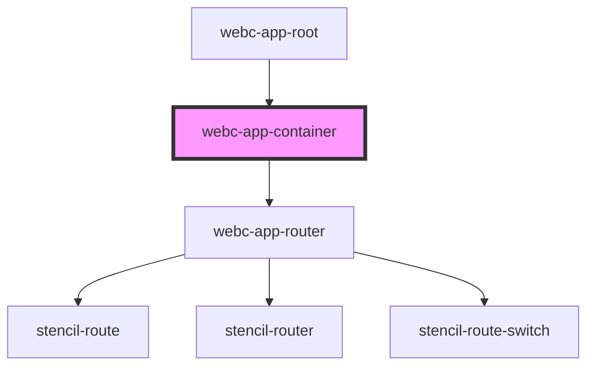

# webc-app-container

<!-- Auto Generated Below -->

## Dependencies

### Used by

 - [webc-app-root](../webc-app-root)

### Depends on

- [webc-app-router](../webc-app-router)

### Graph

----------------------------------------------

*Built with [StencilJS](https://stenciljs.com/)*
