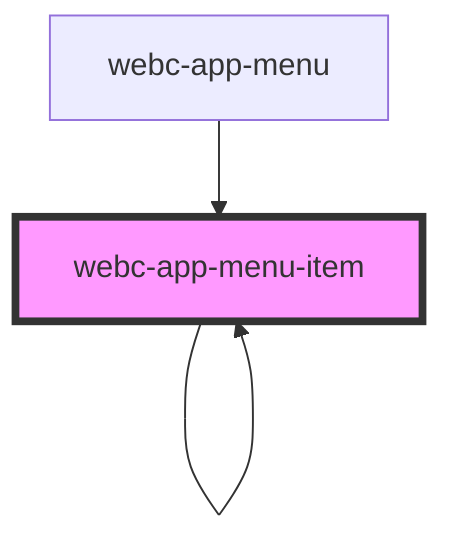

# webc-app-menu-item

<!-- Auto Generated Below -->

## Properties

| Property      | Attribute   | Description | Type                               | Default                                   |
| ------------- | ----------- | ----------- | ---------------------------------- | ----------------------------------------- |
| `basePath`    | `base-path` |             | `string`                           | `''`                                      |
| `item`        | --          |             | `{ path: string; children: any; }` | `{     path: '',     children: null,   }` |
| `level`       | `level`     |             | `number`                           | `0`                                       |
| `menuElement` | --          |             | `HTMLElement`                      | `null`                                    |
| `mode`        | `mode`      |             | `string`                           | `undefined`                               |
| `name`        | `name`      |             | `string`                           | `''`                                      |
| `url`         | `url`       |             | `string`                           | `null`                                    |

## Methods

### `activate() => Promise<void>`

#### Returns

Type: `Promise<void>`

### `deactivate() => Promise<void>`

#### Returns

Type: `Promise<void>`

## Dependencies

### Used by

 - [webc-app-menu](../webc-app-menu)
 - [webc-app-menu-item](.)

### Depends on

- [webc-app-menu-item](.)
- stencil-route-link

### Graph

----------------------------------------------

*Built with [StencilJS](https://stenciljs.com/)*
