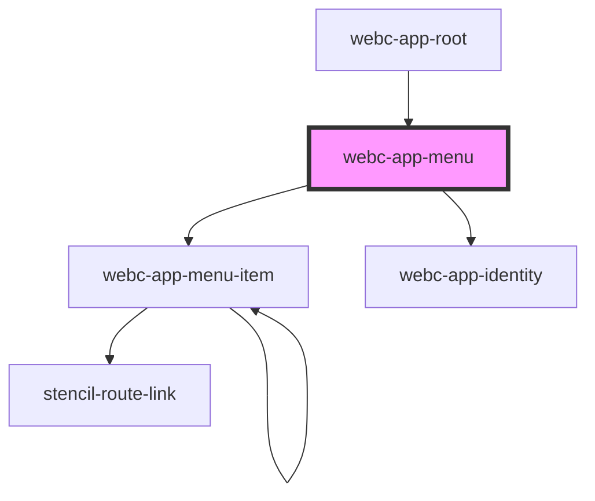

# webc-app-menu

<!-- Auto Generated Below -->

## Properties

| Property          | Attribute          | Description | Type            | Default            |
| ----------------- | ------------------ | ----------- | --------------- | ------------------ |
| `basePath`        | `base-path`        |             | `string`        | `''`               |
| `disableIdentity` | `disable-identity` |             | `boolean`       | `false`            |
| `history`         | --                 |             | `RouterHistory` | `undefined`        |
| `items`           | --                 |             | `any[]`         | `[]`               |
| `mode`            | `mode`             |             | `string`        | `this.defaultMode` |

## Events

| Event                           | Description | Type               |
| ------------------------------- | ----------- | ------------------ |
| `webcardinal:config:getRouting` |             | `CustomEvent<any>` |

## Dependencies

### Used by

 - [webc-app-root](../../webc-app-root)

### Depends on

- [webc-app-menu-item](../webc-app-menu-item)
- [webc-app-identity](../../webc-app-identity)

### Graph

----------------------------------------------

*Built with [StencilJS](https://stenciljs.com/)*
