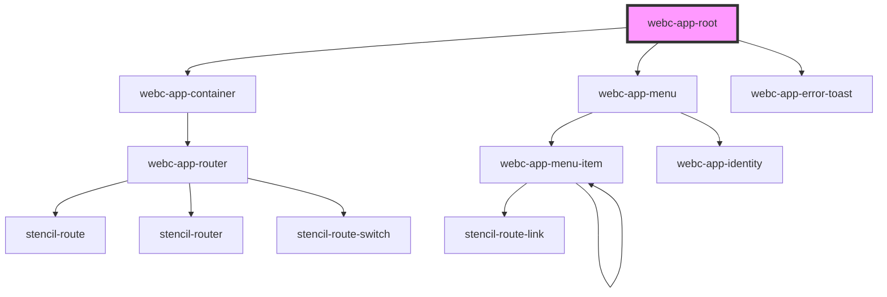

# webc-app-root

<!-- Auto Generated Below -->

## Properties

| Property     | Attribute | Description | Type            | Default          |
| ------------ | --------- | ----------- | --------------- | ---------------- |
| `history`    | --        |             | `RouterHistory` | `undefined`      |
| `loaderName` | `loader`  |             | `string`        | `'webc-spinner'` |

## Events

| Event                            | Description | Type               |
| -------------------------------- | ----------- | ------------------ |
| `webcardinal:config:getLogLevel` |             | `CustomEvent<any>` |

## Dependencies

### Depends on

- [webc-app-container](../webc-app-container)
- [webc-app-menu](../webc-app-menu/webc-app-menu)
- [webc-app-error-toast](../webc-app-error-toast)

### Graph

----------------------------------------------

*Built with [StencilJS](https://stenciljs.com/)*
